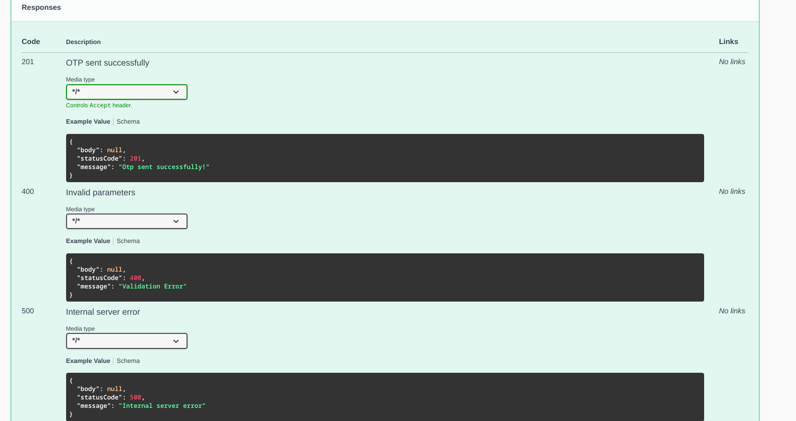

# OTP Service
This is an OTP (One Time Password) service built using Spring Boot. It leverages Twilio for sending OTPs via SMS and Redis for storing OTPs with an expiration time. This service is designed to be simple, and easy to configure.

## Prerequisites
- Java 21
- Spring Boot 3.3.1
- Maven (for building the project)
- Twilio Account (for sending SMS)
- Redis (either local, on the cloud, or via Docker)

## Environment Variables
### You must set up the following environment variables in a file named ``.env`` inside the ```src/main/resources``` directory.
### Create a ```.env file``` in the same directory and fill it with values.

## Environment Variables Setup
### Example ```keys.env``` File
There is an example file called keys.env located in the src/main/resources directory. This file contains all the necessary environment variables required for the OTP Service. Below is the content of the keys.env file:

```
# The following values can be obtained from your Twilio account
TWILIO_API_KEY=
TWILIO_API_TOKEN=
TWILIO_SENDER_NUMBER=
TWILIO_VERIFIED_NUMBER=

# The following values can be obtained from your Redis DB
REDIS_HOST=
REDIS_PORT=
REDIS_PASSWORD=
```
There is also a configurable expiry date for the message which you can modify inside ```application.yaml``` called ```spring.data.redis.expiry-date``` the default is 5 but you can change it
# Getting Started
1. Clone the Repository
   - ```git clone https://github.com/yourusername/otp-service.git```
   - ```cd otp-service```
2. Configure Environment Variables
   - Create the ```.env``` file in ```src/main/resources``` and fill in the required environment variables as explained above.

3. Build the Project
   - ```mvn clean install```
   - This should make a new ```target``` directory which has all the ```.class``` (build) files

4. Run the project
   - ```mvn spring-boot:run```
   - This runs the web server at the default tomcat port 8080 
# How to use
There is an API Documentation that you can check all endpoints and requests,responses descriptions and examples using this link after you run you just go to this endpoint ```http://localhost:8080/swagger-ui/index.html``` on your browser/HTTP Client or go to this one but it wont have lots of visuals like the other one ```http://localhost:8080/v3/api-docs```

This is what you will find if you go to the first endpoint 
 
You can list any of the endpoints and read the request/response schemas and examples 


You can also execute your own test requests and see their responses
Click on ``Try it out`` that is in the second image beside ``Parameters``

If we execute it like this let's see the response

